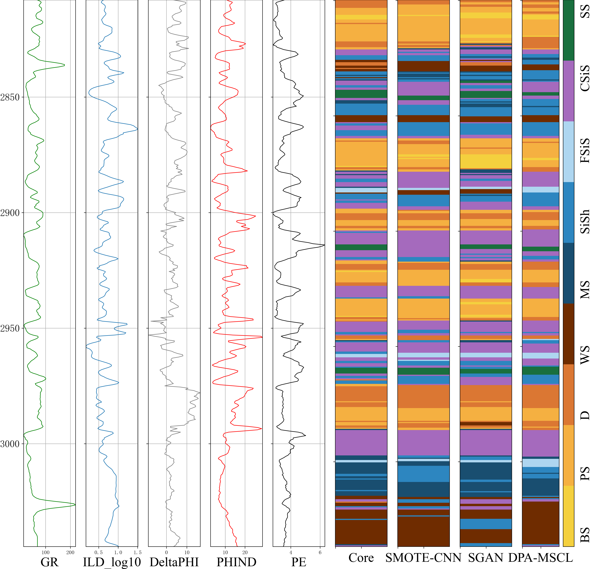
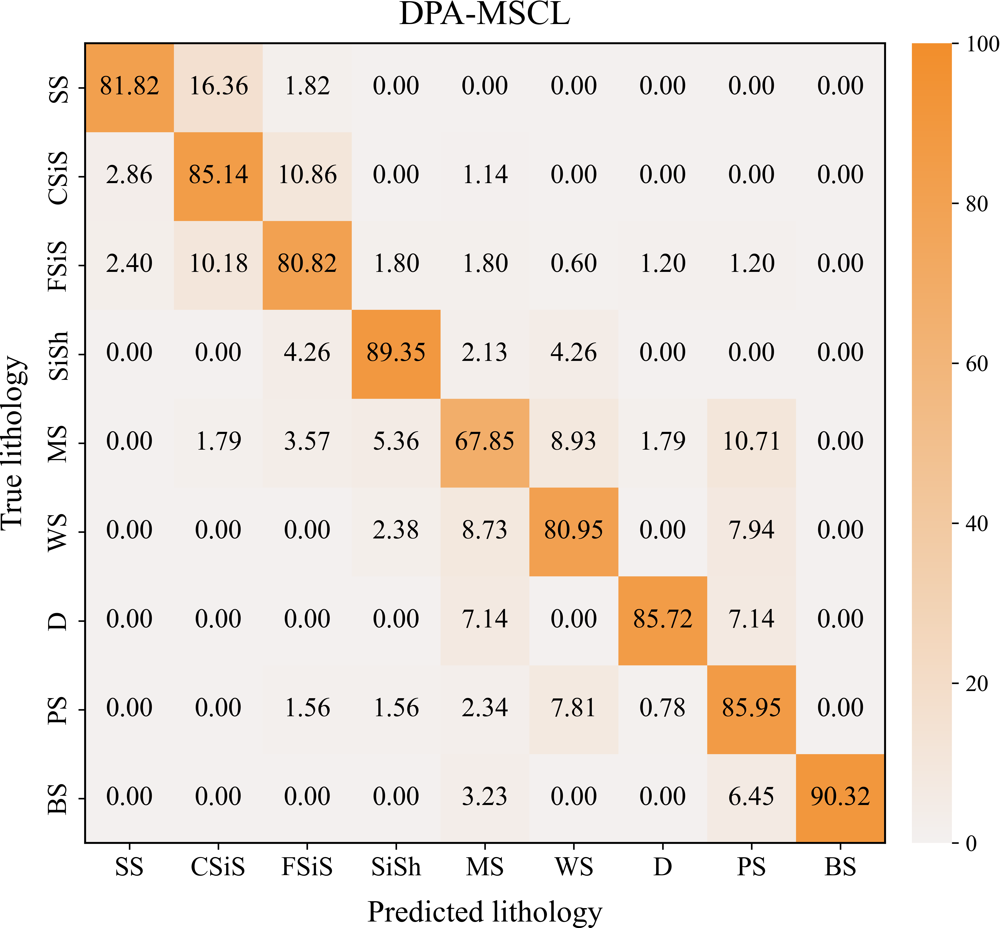
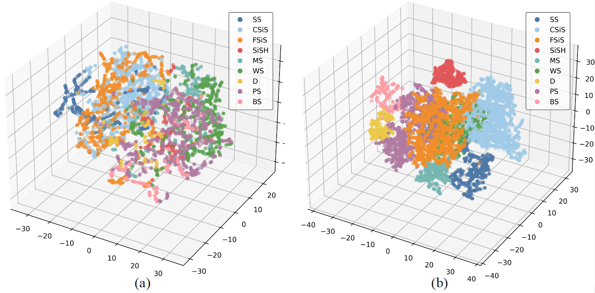

# **DPA-MSCL**
Because the Daqing Oilfield dataset is part of an ongoing project and has not yet been completed, the full dataset cannot be publicly released. Therefore, only a sample dataset is provided for demonstration and reproducibility purposes, while the experimental code related to the Daqing Oilfield dataset is retained.
- **Comparison of Confusion Matrices for Different Model Predictions on the Hugoton and Panoma fields**
- - **Lithologic visualization**

  
  

- - **Comparison of Confusion Matrices**

  
  

- - **3D t-SNE visualization of the feature space on the Hugoton-Panoma dataset before and after representation learning**

  

## The operating environment of the project
-	Python == 3.11.4
- conda == 24.9.2
-	pandas == 2.0.3
-	numpy == 1.23.5
-	matplotlib == 3.7.1
-	seaborn == 0.13.2
-	scikit-learn == 1.5.0
- pickleshare == 0.7.5

## How to use this project？
The root directory contains scripts for the experiments of the model on various datasets.

